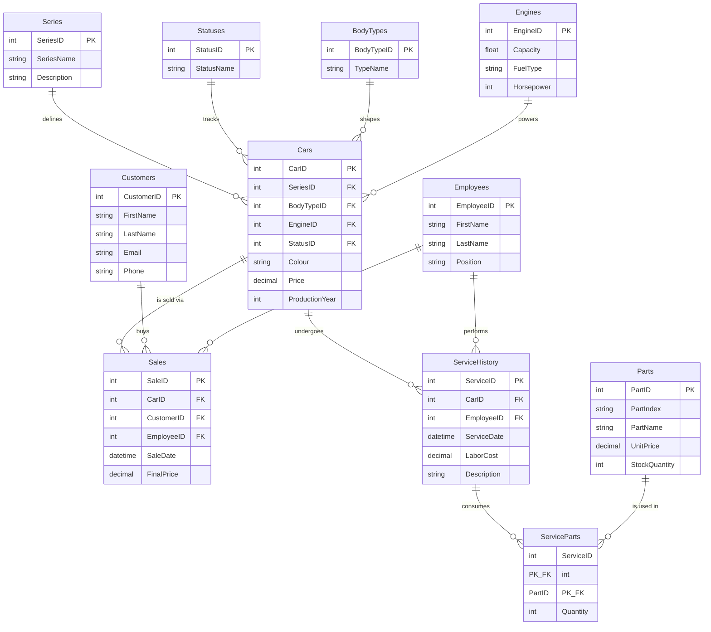

# 🏎️ Ventis Motors - Car Dealership Management System

A comprehensive web application designed for car dealership management, integrating advanced Object-Oriented Programming (OOP) principles in Python with a robust cloud-based relational database architecture.

---

## 🌐 Cloud Deployment Links

The application has been successfully deployed and can be accessed via the following channels:
* **Legacy SQLite Version:** [http://ventis-motors-app.azurewebsites.net/](http://ventis-motors-app.azurewebsites.net/)
* **Production Azure T-SQL Version:** [https://ventis-motors-app-2-db.azurewebsites.net/](https://ventis-motors-app-2-db.azurewebsites.net/)

---

## 🚀 Local Installation & Quick Start

Follow these steps to run the Flask web server locally on your development machine.

### 1. Prerequisites
Ensure you have Python 3.11+ installed. For the Azure T-SQL database connectivity, you also need the Microsoft ODBC Driver installed on your operating system.

### 2. Environment Setup
Clone the repository and install the required dependencies:

    # Clone the repository
    git clone [https://github.com/pawelwolf/Ventis_Motors.git](https://github.com/pawelwolf/Ventis_Motors.git)
    cd Ventis_Motors

    # Install Python packages
    pip install -r requirements.txt

### 3. Running the Application
Execute the primary script to initialize the Flask development server:

    python app.py

Once initialized, open your web browser and navigate to:
👉 **[http://127.0.0.1:5000](http://127.0.0.1:5000)**

---

## 🛠️ Object-Oriented Programming (OOP) Implementation

This project strictly adheres to academic requirements for advanced software design in Python. Below is a checklist of implemented OOP patterns and mechanics:

| OOP Concept / Pattern | Implementation Details |
| :--- | :--- |
| **Inheritance** | `AvailableCar` and `SoldCar` classes inherit from the base `Car` class. |
| **Attribute Overriding** | Descendant classes like `PremiumCar` explicitly introduce and override attributes (e.g., `_warranty_years`). |
| **Method Overriding** | Custom implementations of native methods like `__str__` across class hierarchies. |
| **Decorators** | Extensive utilization of `@classmethod` (alternative constructors) and `@staticmethod`. |
| **Multiple Constructors** | `CarFactory` handles flexible object creation from database rows or web form inputs. |
| **Encapsulation** | Strict data hiding using private attributes (prefixed with `_`) exposed safely via explicit getters and setters with internal data validation. |
| **Polymorphism** | Runtime interface flexibility allowing unified interactions with varying car types. |
| **Parent Class Execution** | Leverages `super().__init__()` to preserve and extend base constructor and method behaviors. |
| **Custom Exception Handling** | Defined `CarNotAvailableException` inheriting from the built-in `Exception` class for robust domain error handling. |
| **Strategy Pattern** | Encapsulates distinct operational behaviors for cars based on their current business status (Available vs. Sold). |
| **Command Pattern** | Implemented through encapsulation workflows like `ResetCarCommand` to trigger state alterations. |
| **Template Method Pattern** | Codified within `CarPurchaseTemplate` to enforce a skeletal algorithm structure for vehicle processing while deferring exact steps to subclasses. |

*Note: Front-end templates incorporate dynamic vanilla JavaScript to create smooth scrolling animations.*

---

## 📊 SQL Database Architecture Specification

The data layer is engineered to model a production-grade relational ecosystem capable of maintaining strict transactional integrity.

### 🗺️ Entity-Relationship Diagram (ERD)
Below is the interactive ERD illustrating the complete database schema, including core car models, business operations, and the advanced parts warehouse/service sub-system:

### Core Database Architecture

* **Schema Blueprint:** Designed an explicit data layout spanning **11 tightly-coupled relational tables** (exceeding the 6-10 academic minimum limit), ensuring logical constraints, foreign key mappings, and cascading integrity.
* **Transactional Reality Simulation:** Native workflows execute advanced data manipulation patterns including `INSERT` actions (new customer ingestion/service parts intake), `UPDATE` routines (promotional batch price modifications), and selective conditional `DELETE` queries complying with data privacy/GDPR mechanics.

### Advanced Analytical Reports & T-SQL Elements

The system includes sophisticated database elements engineered using complex relational and analytical techniques:

1. **Revenue Aggregation:** Transactional revenue aggregation grouped by specific car Series using multiple inner table joins.
2. **Vehicle Matrix:** Complete matrix compilation of mechanical, core, and financial criteria per vehicle.
3. **Customer Profiling:** High-tier customer profiling through financial aggregation and sorting filters.
4. **Performance Tracking:** Employee sales performance tracking leveraging `GROUP BY` accompanied by conditional `HAVING` filters.
5. **Temporal Analytics:** Multi-year business tracking using temporal extraction functions (`YEAR()`).
6. **Automated T-SQL Stored Triggers:** Implemented an `AFTER INSERT` trigger (`TR_OdejmijZMagazynu`) that enforces inventory consistency by automatically reducing stock metrics whenever warehouse parts are consumed by a repair order.
7. **Window Function Analysis:** Incorporated `AVG() OVER (PARTITION BY ...)` analytics to evaluate specific garage operational overhead allocations directly against series-wide baseline margins.

👥 Authors & Team Credits

Paweł Wolf
Konrad Skrzypek
Oliwier Pol
Ivo Czura

🔒 All copyrights reserved © 2026